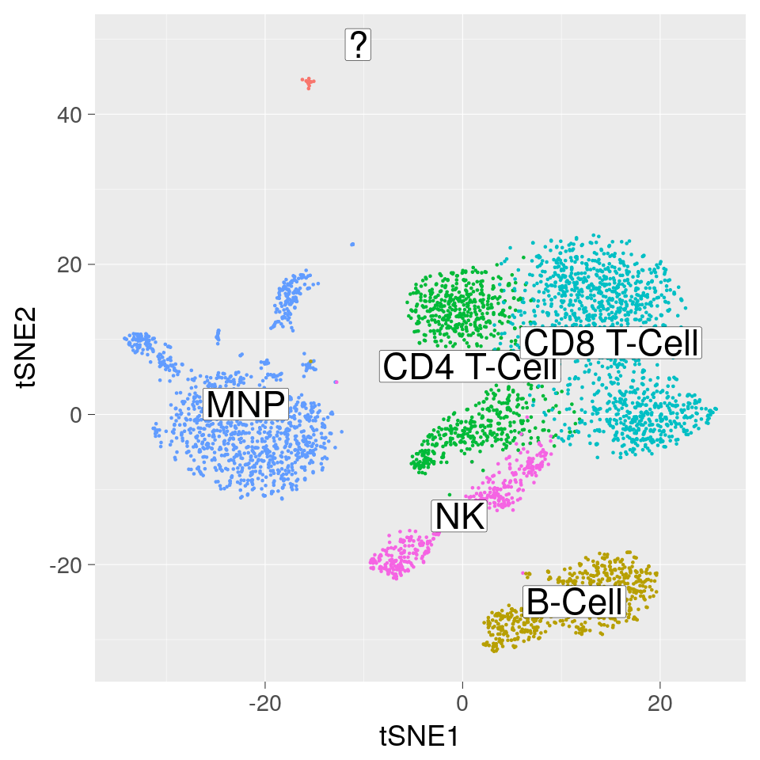
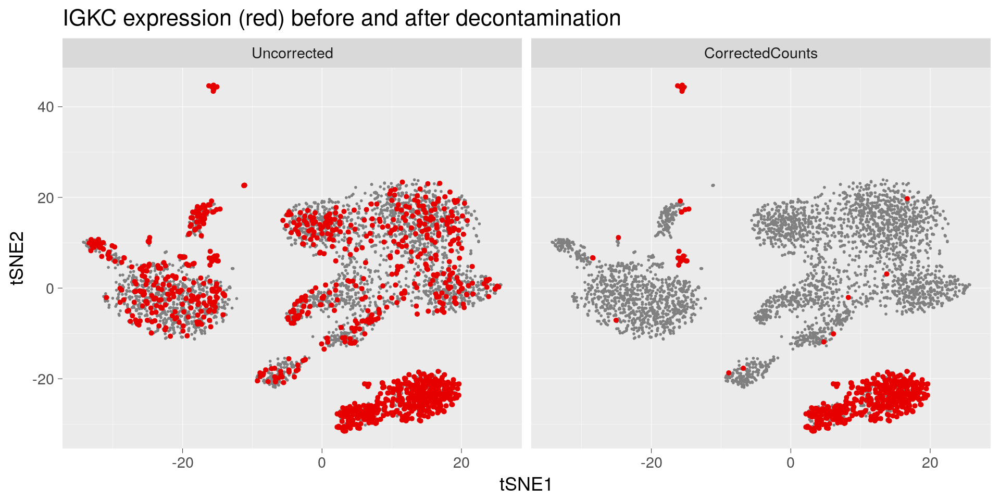

# SoupX

An R package for the estimation and removal of cell free mRNA contamination in droplet based single cell RNA-seq data.

The problem this package attempts to solve is that all droplet based single cell RNA-seq experiments also capture ambient mRNAs present in the input solution along with cell specific mRNAs of interest.  This contamination is ubiquitous and can vary hugely between experiments (2% - 50%), although around 10% seems reasonably common.

There's no way to know in advance what the contamination is in an experiment, although solid tumours and low-viability cells tend to produce higher contamination fractions.  As the source of the contaminating mRNAs is lysed cells in the input solution, the profile of the contamination is experiment specific and produces a batch effect. 

Even if you decide you don't want to use the SoupX correction methods for whatever reason, you should at least want to know how contaminated your data are.

As a quick example, look at the [PBMC data](https://support.10xgenomics.com/single-cell-gene-expression/datasets/2.1.0/pbmc4k).



B-cells should produce antibody genes like IGKC, T-cells and MNP should not.  But without correction, many appear as if they do.  This is because the T-cells also capture the ambient mRNA "soup" containing IGKC mRNAs.  SoupX corrects for this and retains expression only where it should be.



## Installation

The package can be installed by running

```R
devtools::install_github("constantAmateur/SoupX")
```

## Documentation

The methodology implemented in this package is explained in detail in [this paper](https://doi.org/10.1101/303727).  

A detailed vignette is provided with the package and can be viewed [here](https://cdn.rawgit.com/constantAmateur/SoupX/master/inst/doc/pbmcTutorial.html).  

A second vignette discussing common issues with estimating the contamination can be found [here](https://cdn.rawgit.com/constantAmateur/SoupX/master/inst/doc/estimatingContamination.html).

## General remarks

Although the following commentary assumes 10X data, the method should apply to any droplet based single cell sequencing data.

### Method overview

There are three parts to the SoupX method:

1. Estimate what the expression profile of the soup is.  
2. For each cell, calculate what fraction of UMIs are from the soup.
3. Adjust the expression of cells by subtracting the contamination fraction (estimated in 2.) times the soup expression profile (calculated in 1.)

Generally, steps 1 and 3 are pretty simple and robust.  The part of using this method that requires the most care and though is step 2, i.e., working out how much background is present in each cell.  This is parametrised as rho in the code, with rho=0 meaning no contamination and rho=1 meaning 100% of UMIs in a droplet are soup.


### Soup specific genes

To estimate the contamination fraction, we need a set of genes that we know (usually through prior biological knowledge) are not expressed in a cell, so by measuring how much expression we observe we can infer the contamination fraction.  The difficulty is that this set of genes is different for every cell.

Say we're using HBB,HBA2 and IGKC to estimate the contamination fraction.  Let's now look at what happens in a few hypothetical cells:

Cell 1 - Is a red blood cell so expresses HBB and HBA2, but should not express IGKC.  For this cell we want to use IGKC to estimate the contamination fraction but not HBB,HBA2.

Cell 2 - Is a B-Cell so should express IGKC, but not HBB or HBA2.  For this cell we want to use HBB and HBA2 to estimate the contamination fraction, but not IGKC.

Cell 3 - Is an endothelial cell, so should not express any of HBB,HBA2 or IGKC.  So we want to use all three to estimate the contamination fraction.

Basically we are trying to identify in each cell, a set of genes we know the cell does not express so we can estimate the contamination fraction using the expression we do see.

Now obviously the method doesn't know anything about the biology and we haven't told it what's a B cell, a RBC or anything else.  There is nothing stopping you supplying that information if you do have it and that will of course give the best results.

But absent this information, the trick is to use the expression level of the cell to identify when not to use a gene to estimate the contamination fraction in a cell.  This is why we want genes with a bimodal expression distribution across cells, because it tells us that when a cell expresses the gene, it expresses it a lot so we can easily identify these cells and not use that gene for the estimation in those cells.  Given a set of genes that we suspect may be useful, the function `plotMarkerDistribution` can be used to visualise how this gene's expression is distributed across cells.  To continue our example:

Cell 1 - The measured expression of HBB and HBA2 is 10 times what we'd expect if the droplet was filled with soup, so the method will not use either of these genes to calculate rho.  On the other hand IGKC is about .05 times the value we'd get for pure soup, so that is used.

Cell 2 - HBB/HBA2 have values around .05 times the soup.  IGKC is off the charts at 100 times what we'd expect in the soup.  So the method concludes that this cell is expressing IGKC and so uses only HBB/HBA2 to estimate rho.

Cell 3 - All three are at around .05, so all are used to estimate rho.

To get a more accurate estimate, groups with a similar biological function are grouped together so they're either used or excluded as a group.  This is why the parameter nonExpressedGeneList is given as a list.  Each entry in the list is a group of genes that are grouped biologically.  So in our example we would set it like:

nonExpressedGeneList = list(HEM=c('HBB','HBA2'),IG = c('IGKC'))

in this example we'd probably want to include other IG genes and Haemoglobin genes even through they're not as high up our bimodal list, as they should correlate biologically. That is

nonExpressedGeneList = list(HEM=c('HBB','HBA2'),IG = c('IGKC','IGHG1','IGHG3'))

or something similar.

### Global estimates of rho

Although the code will attempt to estimate rho down to the individual cell level given a large enough list of soup determining genes, a global average tends to work pretty well in most instances.  If you find that your cell specific estimates vary wildly, it is advisable to simply use the global trend for all cells in a channel.  That is, if you can get a good channel level estimate of rho, you won't be too far off by just assuming all cells in that channel have that contamination fraction.

## Changelog

### v0.3.0

Now passes R CMD check without warnings or errors.  Added extra vignette on estimating contamination correctly.  Changed the arguments for the interpolateCellContamination function and made montonically decreasing lowess the default interpolation method.  A number of other plotting improvements.

### v0.2.3

Added lowess smoothing to interpolation and made it the default.  Modified various functions to allow single channel processing in a more natural way.  Some minor bug fixes.

### v0.2.2

Integrated estimateSoup into class construction to save memory when loading many channels.
Added function to use tf-idf to quickly estimate markers.
Some minor bug fixes and documentation updates.

### v0.2.1

Update documentation and modify plot functions to return source data.frame.

### v0.2.0

A fairly major overhaul of the data structures used by the package.  Not compatible with previous versions.

### v0.1.1

Some bug fixes to plotting routines.

# License

```
Copyright (c) 2018 Genome Research Ltd. 
Author: Matthew Young <my4@sanger.ac.uk> 
 
This program is free software: you can redistribute it and/or 
modify it under the terms of the GNU General Public License version 3 
as published by the Free Software Foundation. 

This program is distributed in the hope that it will be useful, 
but WITHOUT ANY WARRANTY; without even the implied warranty of 
MERCHANTABILITY or FITNESS FOR A PARTICULAR PURPOSE. See the GNU 
General Public License for more details <http://www.gnu.org/licenses/>. 
```
